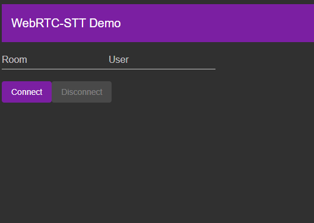

#WebRTC - STT 
## Server Process

In this repo we have an Angular and NestJS stack set up to use Websockets with WebRTC. 

The NestJS Websocket server acts as the Signaling server that helps to connect the Angular Clients together. 

From there, the audio is sent to the Websocket server through the media endpoint, where it's passed on to the Google STT endpoint

### Technologies Used
 - Angular
 - NestJS
 - WebRTC
 - Google STT

### Flow

  - User selects an existing room, or inputs a new one.
  - User joins room
  - WebRTC activates user's media devices
  - MediaStream is sent to other user's via WebRTC, and to the server via websockets. 
  - MediaStream is sent to media websocket endpoint
  - Server mixes and sends to Google STT 
  - Transcription of AudioStream is received
  

